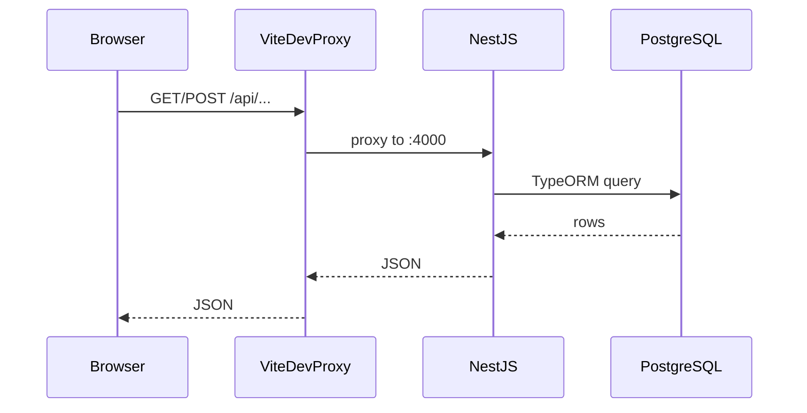
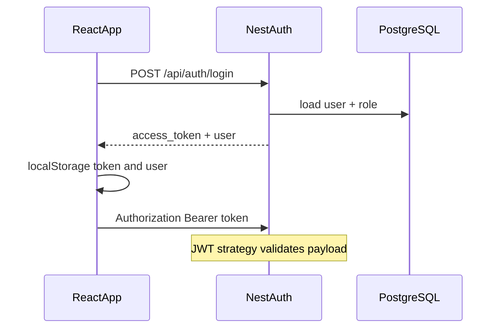
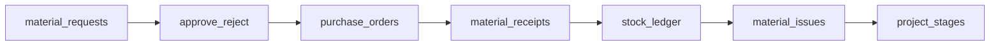
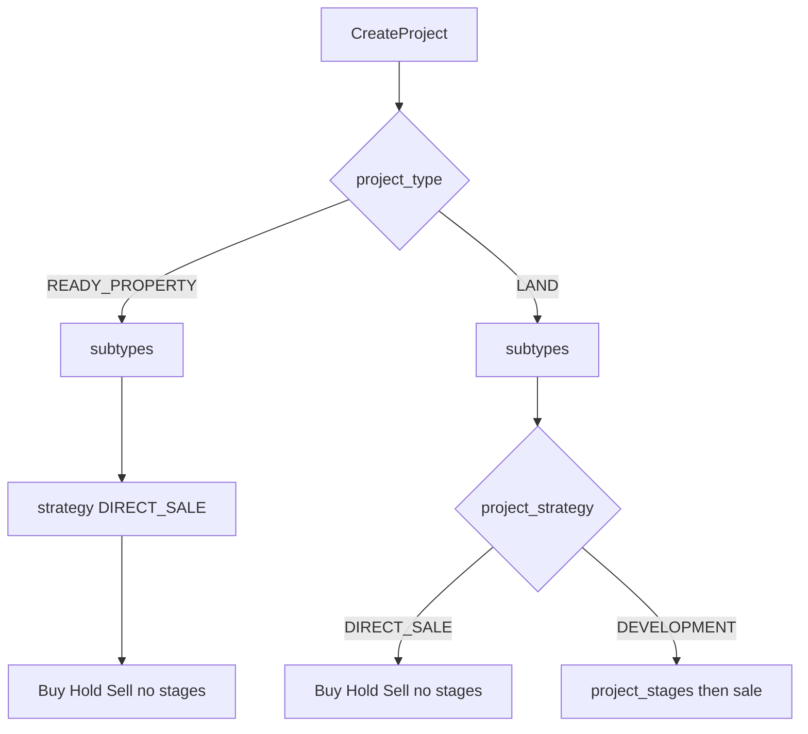
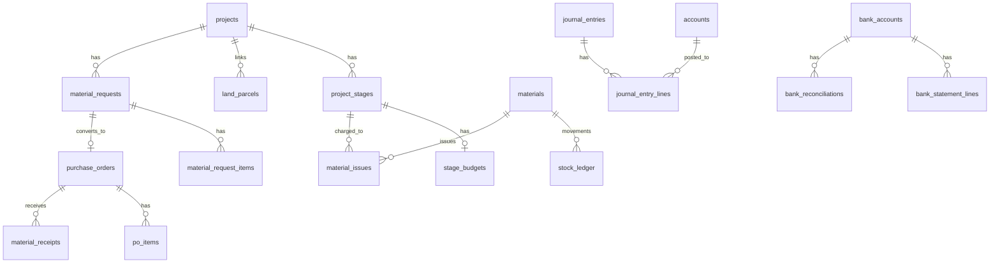

# Architecture

## Stack

| Layer | Technology |
|-------|------------|
| Frontend | React 19, TypeScript, Vite 7, Tailwind CSS 3 |
| Backend (active API) | NestJS 11, TypeORM, JWT (Passport) |
| Database | PostgreSQL |
| Auth | JWT; token stored in `localStorage` on the client |
| Deploy | Render (`render.yaml`, rootDir `backend/server`) |

**SQL reference:** Most files under `backend/db/` are MySQL-oriented. Prefer Nest + Postgres entities for schema. Mock projects seed for Postgres: `backend/db/seed-mock-projects.pg.sql`.

## Frontend structure

```text
frontend/
├── src/
│   ├── App.tsx              # Shell, nav, login, page switcher
│   ├── main.tsx
│   ├── api/                 # fetch wrappers (/api/*)
│   ├── components/          # Modal, StatCard, DetailDrawer, …
│   ├── pages/               # Feature screens (*Page.tsx)
│   └── utils/
├── vite.config.ts           # Proxies /api → http://localhost:4000
└── package.json
```

Vite dev server: `http://localhost:5173`. API calls use relative `/api` (or `VITE_API_URL`).

## Backend structure

```text
backend/
├── server/                  # NestJS app (active) — sole npm package for the API
│   ├── src/
│   │   ├── main.ts          # dotenv/config, listen PORT
│   │   ├── app.module.ts
│   │   ├── auth/
│   │   ├── users/
│   │   ├── projects/
│   │   ├── land/
│   │   ├── procurement/     # POs + material requests
│   │   ├── inventory/
│   │   ├── labour/
│   │   ├── expenses/
│   │   ├── cashflow/
│   │   ├── funds/
│   │   ├── sales/
│   │   ├── accounting/
│   │   ├── reports/
│   │   ├── settings/
│   │   └── health/
│   ├── .env / .env.example
│   └── package.json
└── db/                      # SQL seeds / reference schema
```

API default: `http://localhost:4000`. Env: `PORT`, `DATABASE_URL` **or** `DB_HOST` / `DB_PORT` / `DB_USER` / `DB_PASSWORD` / `DB_NAME`.

TypeORM: `autoLoadEntities: true`, `synchronize: true` (schema from entities on startup).

## Request flow



Production: browser talks to Nest (or reverse proxy) using `VITE_API_URL` / absolute API base as configured.

## Authentication flow



## Material audit trail



Goods receipt API writes stock `RECEIPT` rows in the same flow as marking the PO received.

Creating an **expense**, **sale**, **installment payment**, or **sale collect** also creates and posts balanced journal entries (refs `EXP-*` / `SALE-*` / `PMT-*`) against seeded COA accounts.

**Sale collections**

- Single installment: `POST /api/sales/installments/:id/pay`
- Full/direct on a sale: `POST /api/sales/list/:id/collect` — applies amount FIFO to open installments by `due_date`; if money remains and the sale still has balance, creates a catch-up installment and pays it in the same transaction. Rejects amounts above sale balance due. Project cards expose both modes via **+ Collection**.

## Project type and strategy



- **Ready Property + Direct Sale** sells via `property_units` / Sales.
- **Land + Direct Sale** flips land (parcels); no stages.
- **Land + Development** uses construction stages then sale.

## High-level data relationships



## API conventions

- Nest controllers under paths like `/api/projects`, `/api/land/parcels`, `/api/material-requests`, `/api/accounting/...`
- Frontend clients in `frontend/src/api/*.ts` use `getAuthHeaders()` for Bearer token
- Accounting **writes** enforce JWT + roles (`Admin`, `Owner / Director`, `Accountant`); other modules still soft on guards
- Prefer proper HTTP status codes and explicit error messages
- **Settings** (`settings/`): measurement standards via `app_settings` key/value (`GET`/`PATCH /api/settings/measurement`); demo data reset via `POST /api/settings/reset`
- **Plot size:** projects store `plot_size_sqft` only; UI converts Gazz / Sq. Ft / Marla using Settings Marla factor (Gazz = 9 sq ft fixed)
- **DEVELOPMENT stages:** auto-seeded template; mid-sale via `POST /api/projects/:id/sell-during-construction` locks stages

## Deployment

[`render.yaml`](../render.yaml): web service `construction-erp-api`, `rootDir: backend/server`, build `npm install && npm run build`, start `npm run start:prod`. Set `DATABASE_URL` (and secrets) in the Render dashboard.

See also [Database.md](Database.md), [API.md](API.md), and [Decisions.md](Decisions.md).
